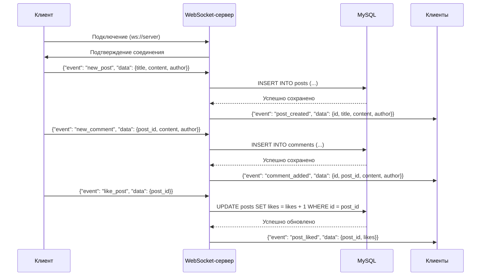
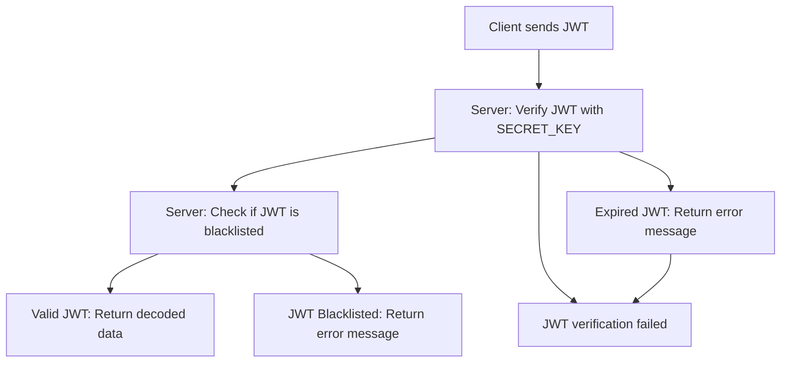

```mermaid
sequenceDiagram
    participant Клиент
    participant WebSocket-сервер
    participant MySQL

    Клиент->>WebSocket-сервер: Подключение (ws://server)
    WebSocket-сервер->>Клиент: Подтверждение соединения

    Клиент->>WebSocket-сервер: {"event": "new_post", "data": {title, content, author}}
    WebSocket-сервер->>MySQL: INSERT INTO posts (...)
    MySQL-->>WebSocket-сервер: Успешно сохранено
    WebSocket-сервер->>Клиенты: {"event": "post_created", "data": {id, title, content, author}}

    Клиент->>WebSocket-сервер: {"event": "new_comment", "data": {post_id, content, author}}
    WebSocket-сервер->>MySQL: INSERT INTO comments (...)
    MySQL-->>WebSocket-сервер: Успешно сохранено
    WebSocket-сервер->>Клиенты: {"event": "comment_added", "data": {id, post_id, content, author}}
    
    Клиент->>WebSocket-сервер: {"event": "like_post", "data": {post_id}}
    WebSocket-сервер->>MySQL: UPDATE posts SET likes = likes + 1 WHERE id = post_id
    MySQL-->>WebSocket-сервер: Успешно обновлено
    WebSocket-сервер->>Клиенты: {"event": "post_liked", "data": {post_id, likes}}

```

## auth

```mermaid
graph TD
    A[Client sends JWT] --> B[Server: Verify JWT with SECRET_KEY]
    B --> C[Server: Check if JWT is blacklisted]
    C --> D[Valid JWT: Return decoded data]
    C --> G[JWT Blacklisted: Return error message]
    B --> E[Expired JWT: Return error message]
    B --> F[Invalid JWT: Return error message]
    E --> F[JWT verification failed]

```