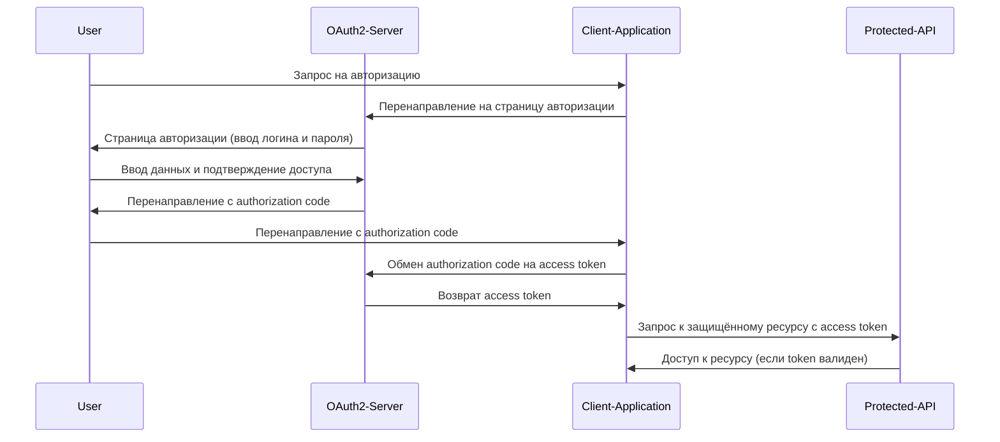
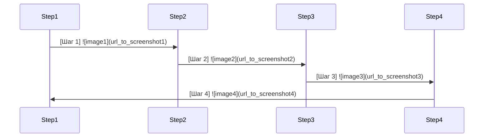

<Badge type="tip" text="Plans" />

```mermaid
sequenceDiagram
    participant User
    participant OAuth2-Server
    participant Client-Application
    participant Protected-API

    User->>Client-Application: Запрос на авторизацию
    Client-Application->>OAuth2-Server: Перенаправление на страницу авторизации
    OAuth2-Server->>User: Страница авторизации (ввод логина и пароля)
    User->>OAuth2-Server: Ввод данных и подтверждение доступа
    OAuth2-Server->>User: Перенаправление с authorization code
    User->>Client-Application: Перенаправление с authorization code
    Client-Application->>OAuth2-Server: Обмен authorization code на access token
    OAuth2-Server->>Client-Application: Возврат access token
    Client-Application->>Protected-API: Запрос к защищённому ресурсу с access token
    Protected-API->>Client-Application: Доступ к ресурсу (если token валиден)

```

```mermaid
sequenceDiagram
    participant Step1
    participant Step2
    participant Step3
    participant Step4

    Step1->>Step2: [Шаг 1] ![image1](url_to_screenshot1)
    Step2->>Step3: [Шаг 2] ![image2](url_to_screenshot2)
    Step3->>Step4: [Шаг 3] ![image3](url_to_screenshot3)
    Step4->>Step1: [Шаг 4] ![image4](url_to_screenshot4)
```