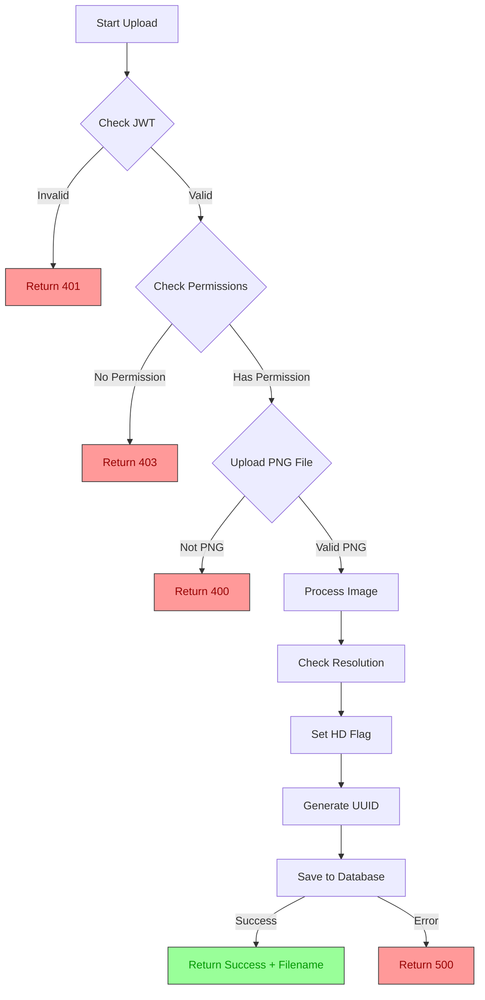
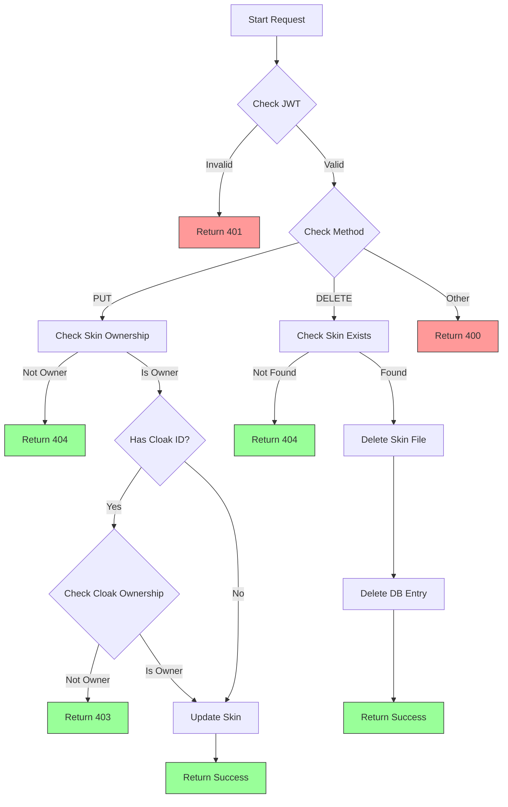

## Skins logic

```mermaid
flowchart TD
    A[Start Upload] --> B{Check JWT}
    B -->|Invalid| C[Return 401]
    B -->|Valid| D{Check Permissions}
    
    D -->|No Permission| E[Return 403]
    D -->|Has Permission| F{Upload PNG File}
    
    F -->|Not PNG| G[Return 400]
    F -->|Valid PNG| H[Process Image]
    
    H --> I[Check Resolution]
    I --> J[Set HD Flag]
    
    J --> K[Generate UUID]
    K --> L[Save to Database]
    
    L -->|Success| M[Return Success + Filename]
    L -->|Error| N[Return 500]

    style M fill:#9f9,stroke:#333,color:#090
    style C fill:#f99,stroke:#333,color:#900
    style E fill:#f99,stroke:#333,color:#900
    style G fill:#f99,stroke:#333,color:#900
    style N fill:#f99,stroke:#333,color:#900

```

## Skin Update

```mermaid
flowchart TD
    A[Start Request] --> B{Check JWT}
    B -->|Invalid| C[Return 401]
    B -->|Valid| D{Check Method}
    
    %% PUT flow
    D -->|PUT| E[Check Skin Ownership]
    E -->|Not Owner| F[Return 404]
    E -->|Is Owner| G{Has Cloak ID?}
    
    G -->|Yes| H{Check Cloak Ownership}
    H -->|Not Owner| I[Return 403]
    H -->|Is Owner| J[Update Skin]
    G -->|No| J
    
    J --> K[Return Success]
    
    %% DELETE flow
    D -->|DELETE| L[Check Skin Exists]
    L -->|Not Found| M[Return 404]
    L -->|Found| N[Delete Skin File]
    N --> O[Delete DB Entry]
    O --> P[Return Success]
    
    %% Invalid method
    D -->|Other| Q[Return 400]

    style K fill:#9f9,stroke:#333
    style P fill:#9f9,stroke:#333
    style C fill:#f99,stroke:#333
    style F fill:#9f9,stroke:#333
    style I fill:#9f9,stroke:#333
    style M fill:#9f9,stroke:#333
    style Q fill:#f99,stroke:#333
```

id - skin id  
uuid - user uuid 
slim - 1 or 0 
locked - 1 or 0